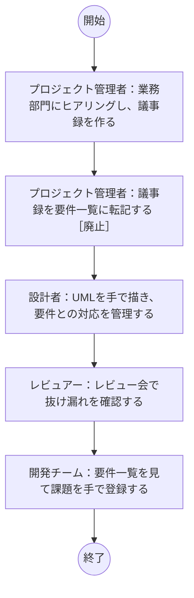
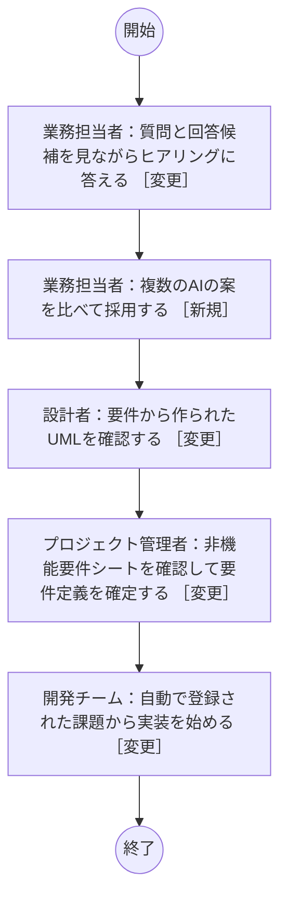

# サンプル事例：要件ナビ（本システム）の要求事項

本システム自身を題材にした要件定義のサンプルです。画面の「AI設定・プロジェクト」→「サンプル事例を読み込む」で、同じ内容のプロジェクトを作れます（AIは呼び出しません）。読み込んだ後は、ヒアリング・UML・画面・仕様書・確定・変更管理・実装連携をそのまま試せます。

> 目的：専門家でなくても、複数のAIと対話しながら、焼き増しでも過大でもない要件を定義し、UML・仕様書・課題として実装工程へ引き渡せるようにする

要件 65件（目的 4・利用者 5・機能 31・非機能 20・制約 5）。機能要件と非機能要件はすべて EARS 記法の検査を通っています。

## 1. 資料の分析（現状の課題と業務の見直し）

資料：D1 = 要件定義の進め方 振り返り会 議事録、D2 = 今の要件定義の進め方（メモ）

要件定義が担当者の経験とExcel・Wordへの転記に頼っており、書き方のばらつき・抜け漏れの後工程での発覚・過大な非機能要件・転記の手間が主な課題です。転記をやめてヒアリングの中で要件を確定し、抜け漏れの確認を前倒しすることで、レビュー会と転記の作業をなくせます。

見直し率 100%／根拠を資料で確かめられた課題 100%／やめる・まとめる等の案 3件

### 現状の課題

| ID | 課題 | 分類 | 根本原因 | 根拠（資料の引用） |
| --- | --- | --- | --- | --- |
| I1 | 要件の書き方が担当者ごとに違う | 属人化 | 要件文の書き方の基準と、それを確かめる仕組みがない | D1「要件定義書はExcelとWordで作り、担当者ごとに書き方が違う。」 |
| I2 | 業務部門の回答があいまいになる | その他 | 専門用語が分からず、何を答えればよいか分からない | D1「業務部門の担当者は専門用語が分からず、ヒアリングの回答があいまいになりがちだ。」 |
| I3 | 抜け漏れが設計工程で見つかる | ミス・手戻り | 確認すべき観点がヒアリングの時点で見えていない | D1「要件の抜け漏れは設計工程のレビューで見つかり、手戻りが多い。」 |
| I4 | 非機能要件が過大になる | その他 | 前の案件の値をコピーし、規模や目的に照らして見直していない | D1「非機能要件は前の案件の資料をコピーしており、稼働率99.99%など過大な値がそのまま残っていた。」 |
| I5 | AIの出力のどれが正しいか判断できない | その他 | 複数の出力を比べて評価する方法がない | D1「AIに要件を作らせたが、使うAIによって内容が大きく違い、どれが正しいか判断できなかった。」 |
| I6 | 設計書と課題管理ツールへの転記に時間がかかる | 二重入力・転記 | 要件・設計・課題が別々のツールで管理されている | D1「設計書と課題管理ツールへの転記に毎回2日かかる。」 |

### 業務の見直し案

| ID | 見直し | 方法 | 効果 | 注意点 |
| --- | --- | --- | --- | --- |
| P1 | Excelへの転記をやめ、ヒアリングの中で要件を確定する | やめる | 転記の作業がなくなる | ヒアリングの場で判断する人が必要 |
| P2 | 抜け漏れの確認をヒアリングの中に前倒しする | 順番・担当を変える | 設計工程での手戻りが減る | ― |
| P3 | 要件文を EARS 記法にそろえる | 標準化する | 書き方のばらつきと解釈の違いが減る | 慣れるまで文型に違和感がある |
| P4 | 複数のAIの案を匿名で比べて選ぶ | 簡単にする | AIの偏りに左右されにくくなる | AIの利用料が増える |
| P5 | 非機能要件を似た事例と比べて決める | 標準化する | 過大な非機能要件を避けられる | ― |
| P6 | 課題の登録を自動にする | 自動化する | 2日の転記がなくなる | 課題管理ツールとの接続の設定が必要 |

### 業務フロー（現状と見直し後）

#### 業務フロー（現状）

#### 業務フロー（見直し後）

### 引き継がないもの

- Excelの要件一覧のテンプレート：要件はシステムで管理し、仕様書として出力する
- 要件とUMLの対応表（Excel）：要件とUML・課題のつながりはシステムがたどる

## 2. 目的

| ID | 要件 | 優先度 |
| --- | --- | --- |
| BR-01 | 専門家でない業務担当者が、AIの支援を受けて要件定義を完了できるようにする | 必須 |
| BR-02 | 複数のAIの案を比べて評価し、特定のAIの偏りや誤りに左右されない要件にする | 必須 |
| BR-03 | 要件・UML・仕様書・課題を、設計と実装の工程へ転記なしで引き渡す | 必須 |
| BR-04 | 今の業務・システムの焼き増しや過大な非機能要件を避け、費用に見合うシステムにする | 推奨 |

## 3. 利用者

| ID | 要件 | 優先度 |
| --- | --- | --- |
| AC-01 | 業務担当者：ヒアリングに答え、案を選んで要件を確定する | 必須 |
| AC-02 | プロジェクト管理者：プロジェクトとAIの構成を決め、要件定義を確定する | 必須 |
| AC-03 | レビュアー：要件・設計・変更要求を確認し、判断を記録する | 推奨 |
| AC-04 | 組織の管理者：AIのAPIキー・利用上限・連携先・利用者の権限を管理する | 必須 |
| AC-05 | 開発チーム：確定した要件・UML・課題を受け取り、実装する | 推奨 |

## 4. 機能要件

| ID | 要件（EARS） | 文型 | 優先度 | 根拠 |
| --- | --- | --- | --- | --- |
| FR-01 | 利用者が質問に回答したとき、要件ナビは、選ばれた生成AIそれぞれに要件案を作成させなければならない。 | イベント駆動 | 必須 | サンプル事例 |
| FR-02 | 2つ以上の要件案がそろったとき、要件ナビは、作成したAIを伏せて評価AIに採点させ、統合案と推奨を示さなければならない。 | イベント駆動 | 必須 | サンプル事例 |
| FR-03 | 要件ナビは、評価の合計点を、評価AIの申告ではなく定めた重みで計算しなければならない。 | 普遍 | 必須 | サンプル事例 |
| FR-04 | 利用者が案を採用したとき、要件ナビは、採用した項目を番号を振って要件に登録し、採用の理由と作成したAIを記録しなければならない。 | イベント駆動 | 必須 | サンプル事例 |
| FR-05 | 要件ナビは、フェーズごとの確認すべき観点について、確定した要件で埋まった割合を表示しなければならない。 | 普遍 | 必須 | サンプル事例 |
| FR-06 | 利用者の回答にあいまいな表現が含まれていた場合、要件ナビは、数値や条件で確かめる質問を示さなければならない。 | 望ましくない振る舞い | 推奨 | サンプル事例 |
| FR-07 | 要件ナビは、画面に出る専門用語に、平易な説明を添えて表示しなければならない。 | 普遍 | 推奨 | サンプル事例 |
| FR-08 | 利用者が議事録や既存システムの資料を取り込んだとき、要件ナビは、本文のテキストを取り出して資料として保存しなければならない。 | イベント駆動 | 推奨 | サンプル事例 |
| FR-09 | 利用者が資料の分析を指示したとき、要件ナビは、現状の業務フロー・課題・業務の見直し案・見直し後の業務フロー・初回の要件案を作成しなければならない。 | イベント駆動 | 推奨 | サンプル事例 |
| FR-10 | 課題の根拠として引用した文が資料に見つからなかった場合、要件ナビは、その引用を「資料に見つからない」と表示しなければならない。 | 望ましくない振る舞い | 推奨 | サンプル事例 |
| FR-11 | 分析の見直し率が30%を下回った場合、要件ナビは、今の業務の焼き増しになっていないか確認を促さなければならない。 | 望ましくない振る舞い | 推奨 | サンプル事例 |
| FR-12 | 要件ナビは、機能要件と非機能要件を EARS 記法の構造で保存し、その構造から要件文を組み立てなければならない。 | 普遍 | 必須 | サンプル事例 |
| FR-13 | 要件文に解釈が分かれる表現が含まれていた場合、要件ナビは、問題の箇所と直し方を表示しなければならない。 | 望ましくない振る舞い | 推奨 | サンプル事例 |
| FR-14 | 利用者がシステムの性格の質問に回答したとき、要件ナビは、非機能要件の各項目に推奨水準を示さなければならない。 | イベント駆動 | 必須 | サンプル事例 |
| FR-15 | 非機能要件の項目どうしに矛盾があった場合、要件ナビは、矛盾する項目と理由を表示しなければならない。 | 望ましくない振る舞い | 必須 | サンプル事例 |
| FR-16 | 非機能要件の水準が推奨または似た事例より高かった場合、要件ナビは、過大の可能性として理由の記録を求めなければならない。 | 望ましくない振る舞い | 推奨 | サンプル事例 |
| FR-17 | 利用者がUMLの作成を指示したとき、要件ナビは、確定した要件からユースケース図・クラス図・シーケンス図・状態遷移図・アクティビティ図を作成しなければならない。 | イベント駆動 | 必須 | サンプル事例 |
| FR-18 | 利用者が画面の作成を指示したとき、要件ナビは、見た目の情報を含まない画面一覧と、クリックで移動できるワイヤーフレームを作成しなければならない。 | イベント駆動 | 推奨 | サンプル事例 |
| FR-19 | 利用者が画面への意見を送ったとき、要件ナビは、見た目の細部に関する意見を設計工程への申し送りとして記録しなければならない。 | イベント駆動 | 推奨 | サンプル事例 |
| FR-20 | 利用者が仕様書の出力を指示したとき、要件ナビは、要件・UML・決定記録を含む仕様書を Word・PDF・Markdown で出力しなければならない。 | イベント駆動 | 必須 | サンプル事例 |
| FR-21 | 利用者が要件定義を確定したとき、要件ナビは、その時点の要件を確定版として保存しなければならない。 | イベント駆動 | 必須 | サンプル事例 |
| FR-22 | 要件定義が確定済みである間、要件ナビは、要件の直接の編集と削除を受け付けず、変更要求として登録させなければならない。 | 状態駆動 | 必須 | サンプル事例 |
| FR-23 | 利用者が変更要求の影響分析を指示したとき、要件ナビは、設計・画面・実装タスク・登録済みの課題への影響と、変更する・代替案・保留・変更しないの選択肢を示さなければならない。 | イベント駆動 | 必須 | サンプル事例 |
| FR-24 | 非機能要件に未検討の項目または要対応の矛盾が残った状態で確定しようとした場合、要件ナビは、確定を止め、残っている項目を表示しなければならない。 | 望ましくない振る舞い | 必須 | サンプル事例 |
| FR-25 | 利用者がタスク分解を指示したとき、要件ナビは、確定した要件をエピック・ストーリー・作業タスクに分け、各ストーリーに元の要件を結び付けなければならない。 | イベント駆動 | 推奨 | サンプル事例 |
| FR-26 | 利用者が課題の登録を指示したとき、要件ナビは、選んだストーリーを GitHub・Jira・Backlog のいずれかに課題として登録しなければならない。 | イベント駆動 | 推奨 | サンプル事例 |
| FR-27 | 課題の登録が途中で失敗した場合、要件ナビは、再実行したときに登録済みの課題を飛ばし、失敗した分だけを登録しなければならない。 | 望ましくない振る舞い | 推奨 | サンプル事例 |
| FR-28 | 組織の管理者がAIを登録したとき、要件ナビは、APIキーを暗号化して保存し、画面には末尾4文字だけを表示しなければならない。 | イベント駆動 | 必須 | サンプル事例 |
| FR-29 | 組織またはAIの今月のトークン利用量が上限に達した場合、要件ナビは、そのAIの呼び出しを止め、利用者に知らせなければならない。 | 望ましくない振る舞い | 必須 | サンプル事例 |
| FR-30 | 要件ナビは、AIへの送信・案の採用・設定の変更を、実行した利用者と日時とともに監査ログに記録しなければならない。 | 普遍 | 必須 | サンプル事例 |
| FR-31 | プロジェクトが機密に指定されている間、要件ナビは、ローカルLLM以外のAIにデータを送信しないようにしなければならない。 | 状態駆動 | 必須 | サンプル事例 |

## 5. 非機能要件

| ID | 要件（EARS） | 文型 | 優先度 | 根拠 |
| --- | --- | --- | --- | --- |
| NFR-01 | 生成AIが応答しなかった場合、要件ナビは、その生成AIを90秒で打ち切り、残りのAIの案で処理を続けなければならない。 | 望ましくない振る舞い | 必須 | サンプル事例 |
| NFR-02 | 利用者がAIの処理を開始したとき、要件ナビは、処理を受け付けた後、進み具合を5秒以内に画面に表示しなければならない。 | イベント駆動 | 必須 | サンプル事例 |
| NFR-03 | 要件ナビは、毎日7時から23時の間、利用者が利用できる状態を保たなければならない。 | 普遍 | 必須 | 非機能要件シート（運用時間） |
| NFR-04 | 要件ナビは、運用時間中の稼働率99%以上を維持しなければならない。 | 普遍 | 必須 | 非機能要件シート（稼働率（止まってよい時間）） |
| NFR-05 | 障害でシステムが停止した場合、要件ナビは、数時間以内に利用を再開できるようにしなければならない。 | 望ましくない振る舞い | 必須 | 非機能要件シート（復旧までの時間（RTO）） |
| NFR-06 | 障害が発生した場合、要件ナビは、数時間前の時点までのデータを復元できるようにしなければならない。 | 望ましくない振る舞い | 必須 | 非機能要件シート（データを戻せる時点（RPO）） |
| NFR-07 | 大規模な災害で設置場所の設備が使えなくなった場合、要件ナビは、別の場所に保管したバックアップからデータを復旧できるようにしなければならない。 | 望ましくない振る舞い | 必須 | 非機能要件シート（大規模な災害への備え） |
| NFR-08 | 要件ナビは、同時に100人の利用者が使っても、応答時間の目標を満たさなければならない。 | 普遍 | 必須 | 非機能要件シート（利用者数・同時に使う人数） |
| NFR-09 | 利用者が画面を操作したとき、要件ナビは、操作の95%について3秒以内に結果を表示しなければならない。 | イベント駆動 | 必須 | 非機能要件シート（画面の応答時間） |
| NFR-10 | 要件ナビは、データ量が現在の3倍になっても、応答時間の目標を満たさなければならない。 | 普遍 | 必須 | 非機能要件シート（データ量の増え方） |
| NFR-11 | 要件ナビは、データのバックアップを毎日取得し1か月保管しなければならない。 | 普遍 | 必須 | 非機能要件シート（バックアップ） |
| NFR-12 | 要件ナビは、すべての利用者を多要素認証で認証しなければならない。 | 普遍 | 必須 | 非機能要件シート（本人確認（ログイン）） |
| NFR-13 | 要件ナビは、利用者の役割と担当範囲に応じて、見られる情報とできる操作を制限しなければならない。 | 普遍 | 必須 | 非機能要件シート（権限（見られる情報・できる操作）） |
| NFR-14 | 要件ナビは、利用者との通信と保存しているデータを暗号化しなければならない。 | 普遍 | 必須 | 非機能要件シート（重要な情報の保護（暗号化）） |
| NFR-15 | 要件ナビは、ログインと重要な操作の記録を1年間保存しなければならない。 | 普遍 | 必須 | 非機能要件シート（操作の記録（ログ）） |
| NFR-16 | 要件ナビは、公表された脆弱性の修正を月1回以上適用しなければならない。 | 普遍 | 必須 | 非機能要件シート（弱点（脆弱性）への対応） |
| NFR-17 | 要件ナビは、会社が指定したパソコンのブラウザで利用できなければならない。 | 普遍 | 必須 | 非機能要件シート（使う端末・ブラウザ） |
| NFR-18 | 要件ナビは、個人情報保護法に従って個人情報を取り扱わなければならない。 | 普遍 | 必須 | 非機能要件シート（守るべき法令・基準） |
| NFR-19 | 要件ナビは、文字を拡大しても利用でき、色だけに頼らずに情報を伝えなければならない。 | 普遍 | 必須 | 非機能要件シート（アクセシビリティ） |
| NFR-20 | 要件ナビは、初めての利用者が30分の説明を受けた後、主要な操作を手順書なしで完了できなければならない。 | 普遍 | 必須 | 非機能要件シート（使い始めるまでの手間） |

## 6. 制約条件

| ID | 要件 | 優先度 |
| --- | --- | --- |
| CN-01 | オープンソース（Apache-2.0）として公開し、GitHubのテンプレートとして再利用できるようにする | 必須 |
| CN-02 | 再配布できる、または著作権表示で利用できるライセンスのOSSだけを使う（GPL・AGPL・SSPLなどは使わない） | 必須 |
| CN-03 | AWSとローカルのDockerの両方で、同じコンテナイメージで動作する | 必須 |
| CN-04 | AIのAPIキーは組織ごとに管理者が登録する | 必須 |
| CN-05 | 利用するAIは Claude・GPT・Gemini・ローカルLLM から選べる | 必須 |

## 7. 非機能要件シート

システムの性格：

- 主に誰が使いますか？ → 社内の多くの人・取引先
- 利用者（アカウント）の人数は？ → 50〜1,000人
- システムの主な目的は？ → 社内の業務を効率化する
- 予算の規模感は？ → 小さい（数百万円まで）
- システムが止まると、どうなりますか？ → 少し不便になるが、手作業で代わりができる
- どんな情報を扱いますか？ → 個人情報・機密情報
- いつ使いますか？ → 毎日、朝から夜まで

重要度：社会的影響がほとんどないシステム

検討済み 100%／要対応・確認 0件／費用・手間の目安 45（推奨どおりなら 52、似た事例の平均 40）

似た事例（参考類型）：社内ポータル・お知らせ掲示板（似ている度合い 89%）、社内の申請・承認（ワークフロー）（似ている度合い 89%）、会員制スクールの受講・会費管理（似ている度合い 89%）

| 大項目 | 項目 | 決定した水準 | 推奨 | 理由 |
| --- | --- | --- | --- | --- |
| 可用性 | 運用時間 | 毎日、朝から夜まで（7〜23時など） | 毎日、朝から夜まで（7〜23時など） | 業務時間の前後にも資料をまとめることがあるため、朝から夜までとする |
| 可用性 | 稼働率（止まってよい時間） | 99%（月に約7時間まで） | 99%（月に約7時間まで） | 止まっても会議や紙で要件定義を続けられるため、月7時間程度の停止は許容する |
| 可用性 | 復旧までの時間（RTO） | 当日中（数時間以内） | 当日中（数時間以内） | コンテナの再起動とデータベースの復元で、当日中に戻せれば業務への影響は小さい |
| 可用性 | データを戻せる時点（RPO） | 数時間前の時点 | 数時間前の時点 | 数時間分の回答は議事録から入力し直せる |
| 可用性 | 大規模な災害への備え | 別の場所にバックアップを保管し、そこから戻す | 別の場所にバックアップを保管し、そこから戻す | 要件の記録は失うと作り直しが大きいため、別の場所にバックアップを置く（AWSのスナップショットを使う） |
| 性能・拡張性 | 利用者数・同時に使う人数 | 500人まで（同時に100人程度） | 500人まで（同時に100人程度） | 組織全体で同時に100人程度の利用を見込む |
| 性能・拡張性 | 画面の応答時間 | 3秒以内 | 3秒以内 | AIの処理は非同期で進み具合を表示するため、画面の操作は3秒以内で十分 |
| 性能・拡張性 | 利用が集中する時期 | 特にない ↓ | 決まった時期に通常の2〜3倍 | 利用が集中する時期は特にない（推奨より低いが、要件定義の作業は案件ごとに分散する） |
| 性能・拡張性 | データ量の増え方 | 数倍に増える | 数倍に増える | 案件が増えるにつれ、5年で数倍になる見込み |
| 性能・拡張性 | 締め処理・まとめて行う処理 | 特にない ↓ | 夜間に終わればよい | AIの処理は1件ずつの非同期ジョブで、夜間にまとめて行う処理はない |
| 運用・保守性 | バックアップ | 毎日取得し、1か月残す ↑ | 週1回取得し、4週間残す | AWSのRDSの自動バックアップを使うため、毎日の取得でも費用はほとんど増えない |
| 運用・保守性 | 監視と障害の知らせ | 利用者からの連絡で気づく | 利用者からの連絡で気づく | 止まっても業務への影響が小さく、ヘルスチェックによる自動再起動で足りる |
| 運用・保守性 | 計画停止（メンテナンス） | 業務時間外ならいつ止めてもよい | 業務時間外ならいつ止めてもよい | 業務時間外に更新すればよい |
| 運用・保守性 | 問い合わせ対応の時間 | 平日の業務時間 | 平日の業務時間 | 問い合わせは平日の業務時間に情報システム部が受ける |
| 移行性 | 今のデータの引き継ぎ | 移さない（新しく始める） ↓ | 必要なもの（基本情報と直近1年分）を移す | 新しく作るシステムで、移すデータはない（過去の要件一覧は資料として取り込める） |
| 移行性 | 切り替えの進め方 | ある日に一斉に切り替える ↓ | しばらく新旧を並行して使う | 新規の導入のため、使い始める日から切り替える |
| セキュリティ | 本人確認（ログイン） | 全員に多要素認証（または会社の共通ログイン） | 全員に多要素認証（または会社の共通ログイン） | 会社の共通ログイン（OIDC：Cognito / Keycloak）を使い、多要素認証は共通ログイン側で行う |
| セキュリティ | 権限（見られる情報・できる操作） | 役割と担当範囲（部署・顧客など）で分ける | 役割と担当範囲（部署・顧客など）で分ける | 組織ごとにデータを分け、管理者・編集者・閲覧者の役割で操作を制限する |
| セキュリティ | 重要な情報の保護（暗号化） | 通信と保存しているデータの両方を暗号化する | 通信と保存しているデータの両方を暗号化する | APIキーと要件に機密情報が含まれうるため、通信と保存データを暗号化する（KMS） |
| セキュリティ | 操作の記録（ログ） | ログインと重要な操作を1年残す ↓ | すべての操作を5年残し、改ざんできないようにする | ログインと重要な操作を記録し、保持期間は組織で設定する。改ざん防止は導入する組織の基準に合わせて追加する |
| セキュリティ | 弱点（脆弱性）への対応 | 月1回、定期的に更新する ↓ | 定期的な更新に加え、年1回は専門家の診断を受ける | 依存関係を自動で更新する（Dependabot）。第三者による診断は導入する組織が実施する |
| システム環境 | 使う端末・ブラウザ | 会社のパソコン（決められたブラウザ） ↓ | パソコンとスマートフォンの主なブラウザ | 業務で使うパソコンの主要なブラウザで使えればよい（推奨より低いが、スマートフォンでの要件定義は想定しない） |
| システム環境 | 守るべき法令・基準 | 個人情報保護法など一般的な法令 | 個人情報保護法など一般的な法令 | 利用者や顧客の個人情報が要件や資料に含まれうるため、個人情報保護法に従う |
| システム環境 | データを置く場所 | 特に決まりはない ↓ | 国内のデータセンター（クラウド可） | 導入する組織が設置場所（AWSの国内リージョンや社内のDocker）を選べるため、システムとしては決めない |
| 使いやすさ・アクセシビリティ | アクセシビリティ | 文字の拡大や、色だけに頼らない表示に対応する | 文字の拡大や、色だけに頼らない表示に対応する | 社内の多くの人が使うため、文字の拡大と色に頼らない表示に対応する |
| 使いやすさ・アクセシビリティ | 使い始めるまでの手間 | 30分程度の説明で使える | 30分程度の説明で使える | 質問・回答候補・用語解説があるため、30分程度の説明で使えることを目標にする |

↑ 推奨より高い／↓ 推奨より低い（いずれも理由を記録）

## 8. ユースケース図

```mermaid
flowchart LR
  A0(["業務担当者"])
  A1(["プロジェクト管理者"])
  A2(["レビュアー"])
  A3(["組織の管理者"])
  A4(["開発チーム"])
  subgraph SYS["要件ナビ（サンプル事例）"]
    U0(("FR-01 利用者が質問に回答したとき、要件ナビは、選ばれた…"))
    U1(("FR-02 2つ以上の要件案がそろったとき、要件ナビは、作成…"))
    U2(("FR-03 要件ナビは、評価の合計点を、評価AIの申告ではな…"))
    U3(("FR-04 利用者が案を採用したとき、要件ナビは、採用した項…"))
    U4(("FR-05 要件ナビは、フェーズごとの確認すべき観点について…"))
    U5(("FR-06 利用者の回答にあいまいな表現が含まれていた場合、…"))
    U6(("FR-07 要件ナビは、画面に出る専門用語に、平易な説明を添…"))
    U7(("FR-08 利用者が議事録や既存システムの資料を取り込んだと…"))
    U8(("FR-09 利用者が資料の分析を指示したとき、要件ナビは、現…"))
    U9(("FR-10 課題の根拠として引用した文が資料に見つからなかっ…"))
    U10(("FR-11 分析の見直し率が30%を下回った場合、要件ナビは…"))
    U11(("FR-12 要件ナビは、機能要件と非機能要件を EARS 記…"))
    U12(("FR-13 要件文に解釈が分かれる表現が含まれていた場合、要…"))
    U13(("FR-14 利用者がシステムの性格の質問に回答したとき、要件…"))
    U14(("FR-15 非機能要件の項目どうしに矛盾があった場合、要件ナ…"))
    U15(("FR-16 非機能要件の水準が推奨または似た事例より高かった…"))
    U16(("FR-17 利用者がUMLの作成を指示したとき、要件ナビは、…"))
    U17(("FR-18 利用者が画面の作成を指示したとき、要件ナビは、見…"))
    U18(("FR-19 利用者が画面への意見を送ったとき、要件ナビは、見…"))
    U19(("FR-20 利用者が仕様書の出力を指示したとき、要件ナビは、…"))
    U20(("FR-21 利用者が要件定義を確定したとき、要件ナビは、その…"))
    U21(("FR-22 要件定義が確定済みである間、要件ナビは、要件の直…"))
    U22(("FR-23 利用者が変更要求の影響分析を指示したとき、要件ナ…"))
    U23(("FR-24 非機能要件に未検討の項目または要対応の矛盾が残っ…"))
    U24(("FR-25 利用者がタスク分解を指示したとき、要件ナビは、確…"))
    U25(("FR-26 利用者が課題の登録を指示したとき、要件ナビは、選…"))
    U26(("FR-27 課題の登録が途中で失敗した場合、要件ナビは、再実…"))
    U27(("FR-28 組織の管理者がAIを登録したとき、要件ナビは、A…"))
    U28(("FR-29 組織またはAIの今月のトークン利用量が上限に達し…"))
    U29(("FR-30 要件ナビは、AIへの送信・案の採用・設定の変更を…"))
    U30(("FR-31 プロジェクトが機密に指定されている間、要件ナビは…"))
  end
  A0 --- U0
  A0 --- U1
  A0 --- U2
  A0 --- U3
  A0 --- U4
  A0 --- U5
  A0 --- U6
  A0 --- U7
  A0 --- U8
  A0 --- U9
  A0 --- U10
  A0 --- U11
  A0 --- U12
  A0 --- U13
  A0 --- U14
  A0 --- U15
  A0 --- U16
  A0 --- U17
  A0 --- U18
  A0 --- U19
  A0 --- U20
  A0 --- U21
  A0 --- U22
  A0 --- U23
  A0 --- U24
  A0 --- U25
  A0 --- U26
  A3 --- U27
  A0 --- U28
  A0 --- U29
  A0 --- U30
```

